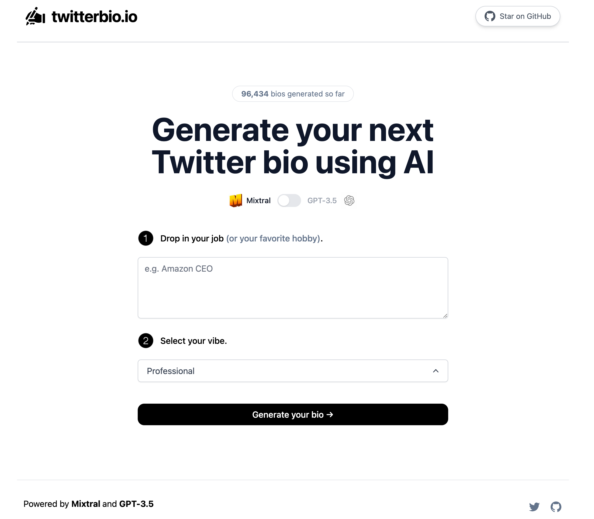

# [betterprompts.io](https://www.betterprompts.io/)

This project generates better prompts for you using AI based on your input and requests.

<!--  -->

## How it works

This project uses both [Mixtral](https://mistral.ai/news/mixtral-of-experts/) and [GPT-3.5](https://openai.com/api/) with streaming to generate improved prompts to get the most out of ChatGPT and Mixtral. It constructs a prompt based on the form and user input, sends it either to the Mixtral API through [Together.ai](https://www.together.ai/) or the GPT-3.5 API through OpenAI, then streams the response back to the application.

## Running Locally

1. Create an account at [OpenAI](https://beta.openai.com/account/api-keys) and add your API key under `OPENAI_API_KEY` in your `.env`
2. Create an account at [Together.ai](https://www.together.ai/) and add your API key under `TOGETHER_API_KEY`
3. Run the application with `npm run dev` and it will be available at `http://localhost:3000`.

## One-Click Deploy

Deploy the example using [Vercel](https://vercel.com?utm_source=github&utm_medium=readme&utm_campaign=vercel-examples):
